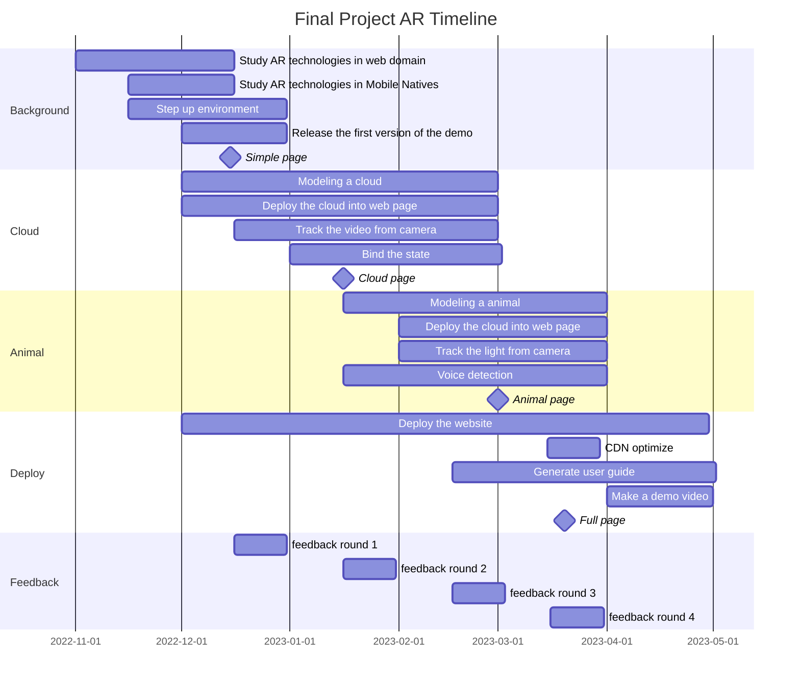
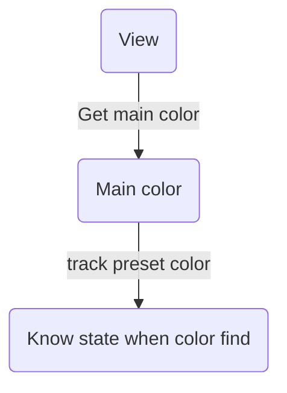
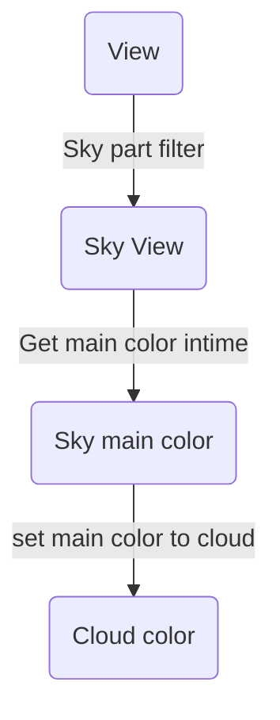

# Final Project Presentation

Applying AR technology for art exhibition on Mobile devices

<div class="absolute bottom-10">
  <span class="font-700">
    Wu Mingze
  </span>
</div>

<!--
Hello, everyone, I am Wu Mingze, and i am gonna talk about my final project which is applying AR technology for artexhibiton on Mobile devices
-->

---
layout: intro-image-right
image: /ar.jpg
---

# Augmented Reality

an interactive experience that combines the real world and computer-generated content.

<!--
First, AR as Augmented Reality is different from VR, VR is something u put a vr headsets on, such as pico4 from bytedance or quest pro from meta. And when u put the headsets on, u diverse into a virtual world like "Ready Player One", a film by Spielberg on 2018. That's VR, and AR is to combine the real world and computer-generated content, which means u can see overlay of generated content by screen and the real world by camera
-->

---
layout: section
---

# The Outcomes

<!--
Second I am gonna talk about the outcoms
-->

---
layout: two-cols
---

# Cloud

<br/>
<br/>
displaying the AR subject (cloud)

which colors will change according to the light shifting in the surrounding environment
<br/>


::right::

# Animal

<br/>
<br/>
displaying the AR subject (animal)

which forms will change according to the sound trigger from the surrounding environment
<br/>


<!--
the project is applying ar technology to a art exhibiton, and i am gonna show two pilot demo, one is a cloud and the other is an animal, moreover, the cloud needs to change according to the light shifting, which is the hardest part in this project. And the animal will interact with the ambient sound, if u talk loud maybe the animal will scared or angry. something like this. So a full animation for the animal is needed.
-->

---
layout: section
---

# Stacks

<!--
third part is about the stacks and the technology section
-->

---

# AR SDK Technology Selection

* ARCore  <PajamasGoogle/> with kotlin <LogosKotlinIcon/> for Android
* ARKit   <CibApple/> with swift <LogosSwift/> for iOS
* AR Foundation <LogosUnity/> with C# for Unity, Android and iOS
* Ar.js <LogosJavascript/> with three.js <LogosThreejs/> for web, Android and iOS

<!--
first thing first, how to find the write ar sdk techonology which is Suitable for the exhibiton. well i think if no need to install the program, it is best not to install it. And It's best that everyone can use it on their mobile phones whether it's Apple or Android because as cindy said this will literally apply to a exhibition and its a demo for bussiness not a demo for study. so if it is a app, i need to learn arcore with kotlin and arkit with swift. and when user use it they need to download app i think that makes the project too heavy. i prefer to make the project light to use. so i choose the last one. one more thing i also consider to use miniprogram from wechat but its on beta version and there are a lot of limits, but if it goes well, the program will also be ported to the wechat
-->

---

# Modeling Technology Selection

* blender <LogosBlender/>

<br/>
<br/>


<!--
second one is modeling, i choose blender definitely, because i used it before and i think its the best modeling software for small model
-->

---

# Tracking Technology Selection

* tracking.js

<br/>
<br/>


<!--
third part is tracking, the cloud should track the light, and i do a lot of reseach, the light should change its color instead of change its intensity. first, not every phone has a ambient light sensor, second AR requires stable light intensity for positioning, hence here i will use tracking.js to track the colors from the camera. u can see it can circle the colors of yellow and purple
-->

---
layout: two-cols
---
# Audio Technology Selection

* Audioworklet

::right::

<iframe src="https://goblin-laboratory.github.io/volume-meter/" class="rounded w-full h-full object-cover" allow='microphone'></iframe>

<!--
fourth is audio technology, i will use audioworklet for tracing the volume, it is common that many online meeting has this feature, u speak and u can see the voulme from your micphone that is base on the audioworklet
-->

---

# Final stack section

<br/>
<br/>

AR.js + blender <LogosBlender/> + three.js <LogosThreejs/> + tracking.js + webRTC <LogosWebrtc/>

<br/>

Ar.js for AR content

blender for 3D modeling

three.js for 3D rendering

tracking.js for color tracking

webRTC for video streaming

<!--
now let me make a summary, i am going to build a webpage which can run on any browser, and use these stacks to build it.
-->

---

# Timeline



---
layout: section
---

# 12/07 Demo 🧑‍💻

<!--
OK, i am gonna tell u my current progress and follow-up plans, because my project is a engineer instead of a research hence let's just forward to the result.
-->

---
layout: two-cols
---

# Cloud 🌩️

* link: [cloud.lawted.tech](https://cloud.lawted.tech)
* track HIRO marker


::right::

<div class="w-full h-full flex justify-center items-center">
  <video src="/cloud_computer.mp4" class="rounded-xl w-1/2 object-scale-down" controls></video>
</div>

<!--
take a look at the video on the left, this is a screenshoot on my phone and u can see the cloud is stick on the hiro marker. and when we walk to another direction the cloud won't rotate but show another aspect
-->

---

# Blend the cloud model

* [cloud.blend](https://sketchfab.com/3d-models/cloud-3a76eb255e3c4c0199bbfedb2b54342f)

<br/>


<!--
i download the cloud model and it looks great in the modeling software
-->

---
layout: two-cols
---

# AR.js to position the cloud

* hiro marker is used to position the cloud

<br/>
<br/>

```html {8|4-9|all}
<!-- main code -->
...
    <a-scene embedded arjs>
    <a-marker preset="hiro">
        <a-entity
        position="-0.5 1.5 0"
        scale="0.3 0.3 0.3"
        gltf-model="/cloud.gltf"
        ></a-entity>
    </a-marker>
    <a-entity camera></a-entity>
    </a-scene>
...
```

::right::

<div class="w-full h-full flex justify-center items-center">
  
</div>

<!--
second part is track by ar.js, here is part of the code we export the cloud to gltf format and use a-marker to position it
-->

---
layout: two-cols
---

# deploy the page

* use tencent cloud server to deploy the page
* use nginx to add ssl certificate
* enable to use on phone and computer in browser

```nginx
server {
    listen 443 ssl;
    server_name cloud.lawted.tech;
    ssl_certificate /etc/nginx/ssl/cloud.lawted.tech/fullchain.cer;
    ssl_certificate_key /etc/nginx/ssl/cloud.lawted.tech/cloud.lawted.tech.key;
    ssl_session_timeout 5m;
    ssl_protocols TLSv1 TLSv1.1 TLSv1.2;
    ssl_ciphers ALL:!ADH:!EXPORT56:RC4+RSA:+HIGH:+MEDIUM:+LOW:+SSLv2:+EXP;
    ssl_prefer_server_ciphers on;
    location / {
        root /var/www/cloud;
        index index.html index.htm;
    }
}
```

::right::


<div class="w-full h-full flex justify-center items-center">
  
</div>

<!--
final part is deploy the page, now its on my website and because if the website need to control the camera it should be cetificate by ssl and deploy as a https website
-->

---
layout: bullets
---

# Next step improvement

* add more cloud models and make them move

* use track.js to track the light and make the cloud change its color

<!--
add more status of cloud, such as clouds in morning and afternoon and eve

second thing is use track.js to track the color change in the video.
-->

---
layout: section
---
# Early-term Progress Report 🐦

---
layout: two-cols
---

# Overview

> successfully deployed a cloud page that is able to track the hiro marker and change the color of the cloud based on the sky color.


* ✅ Deploy on the website
* ✅ Model cloud track the hiro marker
* ✅ Sky color detection
* ✅ Cloud color change based on the sky color


::right::

<div class="w-full h-full flex justify-center items-center">
  <video src="/early-progress-report-overview.mp4" class="rounded-xl w-1/2 object-scale-down" controls></video>
</div>

---
layout: section
---

# Challenges


---
layout: two-cols
---

## tracking.js track preset color



::right::

## Sky color detection




---
layout: two-cols
---

# Tracking.js in detecting weather

> use tracking.js to track some color but it's not accurate enough, and hard to tell the difference

tracking.js can track

* similar color 🟡
* color position ❌

But what we need

* tracking specific color 🔵


:: right ::

<div class="w-full h-full flex justify-center items-center">
  <video src="/tracking-yellow-color.mp4" class="rounded-xl w-1/2 object-scale-down" controls></video>
</div>

<!-- The limitations of tracking.js in detecting weather with the camera -->
---

# Identifying various shades of blue

<div class="grid grid-cols-2 gap-2">
  <div class="flex align-center gap-2">
    <div class="bg-[#5da8d0] w-min rounded-lg text-white p-1 my-auto"> #5da8d0 </div>
    
  </div>

  <div class="flex align-center gap-2">
    <div class="bg-[#4393be] w-min rounded-lg text-white p-1 my-auto"> #4393be </div>
    
  </div>

  <div class="flex align-center gap-2">
    <div class="bg-[#4184b4] w-min rounded-lg text-white p-1 my-auto"> #4184b4 </div>
    
  </div>

  <div class="flex align-center gap-2">
    <div class="bg-[#286ba4] w-min rounded-lg text-white p-1 my-auto"> #286ba4 </div>
    
  </div>

  <div class="flex align-center gap-2">
    <div class="bg-[#04548d] w-min rounded-lg text-white p-1 my-auto"> #04548d </div>
    
  </div>

  <div class="flex align-center gap-2">
    <div class="bg-[#1b233c] w-min rounded-lg text-white p-1 my-auto"> #1b233c </div>
    
  </div>
</div>

---

# Identifying various shades of blue

tracking method use rgb and the difference between red and blue or green and blue, or the distance between source color and the tracked color, and both two method can't track specific color and tell the shade of blue which we need


```js{7-9|10}
tracking.ColorTracker.registerColor('yellow', function(r, g, b) {
  var threshold = 50,
    dx = r - 255,
    dy = g - 255,☁️
    dz = b - 0;

  if ((r - b) >= threshold && (g - b) >= threshold) {
    return true;
  }
  return dx * dx + dy * dy + dz * dz < 10000;
});
```

<!-- The first method is using a threshold value of 50 to check if the difference between the red and blue color values is greater than or equal to the threshold, and if the difference between the green and blue color values is greater than or equal to the threshold. If both of these conditions are true, then the function will return true to indicate that the color is yellow.

The second method is using a "distance" formula to calculate the distance between the given color (r, g, b) and the color white (255, 255, 0). If this distance is less than 10000, then the function will again return true to indicate that the color is yellow.
 -->


<!-- The difficulty of accurately identifying various shades of blue and black using the RGB color space -->


---
layout: two-cols
---

# Impact of buildings

<!-- The impact of buildings on the screen on the tracking of main colors -->

the buildings on the screen will affect the tracking of main colors, and the color is not smoothly change


**The lack of existing solutions for sky detection using browser-based JavaScript implementation**

[](https://github.com/cftang0827/sky-detector)

[](https://github.com/MaybeShewill-CV/sky-detector)


::right::

<div class="w-full h-full flex justify-center items-center">
  <video src="/impact-building.mp4" class="rounded-xl w-1/2 object-scale-down" controls></video>
</div>

---
layout: section
---

# Solutions


---
layout: two-cols
---

<div class="opacity-30">

## tracking.js track preset color


</div>

::right::

## Sky color detection


---

# Sky Part filter

* Use of opencv.js for more advanced image processing instead of simply tracking specific colors,

* Use of image segmentation and sky detection techniques, including the use of a Laplacian filter to extract parts of the image with lower variance than a threshold

* World First Sky Detection Using JavaScript

```js
const getSkyRegionGradient = (src, mask, h, w) => {
  let imgGray = new cv.Mat();
  cv.cvtColor(src, imgGray, cv.COLOR_RGBA2GRAY, 0);

  cv.blur(imgGray, imgGray, kSize);
  cv.medianBlur(imgGray, imgGray, 5);
  let lap = new cv.Mat();
  cv.Laplacian(imgGray, lap, cv.CV_8U, 1, 1, 0, cv.BORDER_DEFAULT);
  let gradient_mask = new cv.Mat();
  cv.threshold(lap, gradient_mask, 6, 255, cv.THRESH_BINARY_INV);
  let M = cv.Mat.ones(9, 3, cv.CV_8U);
  cv.erode(gradient_mask, mask, M);
  imgGray.delete();
  lap.delete();
  calSkyLine(mask, h, w);
};
```

---

# Sky Part filter

the sky part filter will get the sky part of the image

<br/>

<video src="/skyline.mp4" class="rounded-xl object-scale-down" autoplay loop></video>


---

# Sky Part filter

the main color of the sky part change smoothly

<video src="/sky-filter-main-color.mp4" class="rounded-xl object-scale-down" autoplay loop></video>

---

# Get main color realtime

use a class written by `whoiam2007s` to track the main color of the sky part, but change the input image type from canvas image to uint8array


[](https://github.com/whoiam2007s/ImgMainColor)

```js{1-8|9}
new ImgMainColor(
  {
    imageData: skyView,
  },
  function (color) {
    const { hex } = color
    currentColor.style.backgroundColor = hex;
    currentColor.innerHTML = hex;
    model.attributes['light'].value = `type: ambient; color: ${hex}`;
  }
);
```

---
layout: section
---

# Applying AR technology for art exhibition on Mobile devices

##  Mid-term Progress Report 🏃‍♂️

<div class="absolute bottom-10">
  <span class="font-700">
    Wu Mingze
  </span>
</div>

---
layout: two-cols
---

# Exhibition Demo

<br/>


::right::

<br/>
<br/>
<br/>


---
src: ./timeline.md
---

---
layout: two-cols
---

# Main Page

> User select the page they want to go to by clicking the button in the main page

* 🏃‍♂️ View by Motion Sensor
* 🖐️ Scale by Finger Touch
* 🔘 Click the Button to Redirect to the Page

::right::

<div class="w-full h-full flex justify-center items-center">
  <iframe src="https://cloud.lawted.tech" class="h-full w-2/3 rounded-xl"></iframe>
</div>


---

<div class="grid grid-cols-4 gap-4">

<div class="col-span-3">

# Cloud Page

> Users scan the marker on the ceiling with their mobile phone to observe the cloud, and the cloud will change color according to the color behind the marker

<br/>

## ✅ Finished
* ☁️ Deploy the [Cloud Page](https://cloud.lawted.tech/cloud)
* 🎨 Track the Main Color of the Screen and Change the Color of the Cloud
* ⚙️ Orbit Control the Object and Scale by Finger Touch

## 🚧 In Progress
* <FileIconsVertexshader/> Use shader to implement the cloud effect (volume ray cast effect)

</div>

<div class="col-span-1 h-full flex justify-center items-center">
  <video src="/cloud-page.mp4" class="rounded-xl object-scale-down" controls autoplay loop></video>
</div>

</div>

---

<div class="grid grid-cols-4 gap-4">

<div class="col-span-3">

# Fox Page

> Users can observe the fox by scanning the signs on the ground, and change the fox's actions by talking and shouting.

<br/>

<div class="absolute right-80 top-60 flex">
<div class="flex flex-col justify-between h-50 mr-1">
  <h3>
    HIGH
  </h3>
  <h2 style="writing-mode: vertical-rl; transform: rotate(180deg)" >
    Volume
  </h2>
  <h3 >
    Low
  </h3>
</div>

<div class="flex flex-col border-light-500 border-2 rounded-lg justify-between my-1 ">

  <div class="bg-red-400 rounded-t-md h-20 text-center"> run </div>
  <div class="bg-green-400 h-15 text-center"> walk </div>
  <div class="bg-gray-400 rounded-b-md h-15 text-center p-1"> survey </div>


</div>
</div>


## ✅ Finished

* 🦊 Deploy the [Fox Page](https://cloud.lawted.tech/fox)
* 🔊 Detect the level of the surrounding environment volume
* 🎥 Animation will Change when Volume Meter Changes
* ⚙️ Orbit Control the Object and Scale by Finger Touch

## 🚧 In Progress
* <LogosTensorflow/> Use `tensorflow.js` to detect the voice by human
* 🎬 Create more animation for the fox

</div>


<div class="col-span-1 h-full flex justify-center items-center">
  <video src="/fox-page.mp4" class="rounded-xl object-scale-down" controls autoplay loop></video>
</div>

</div>


---
layout: quote
---

# "Thanks for your listening!"
