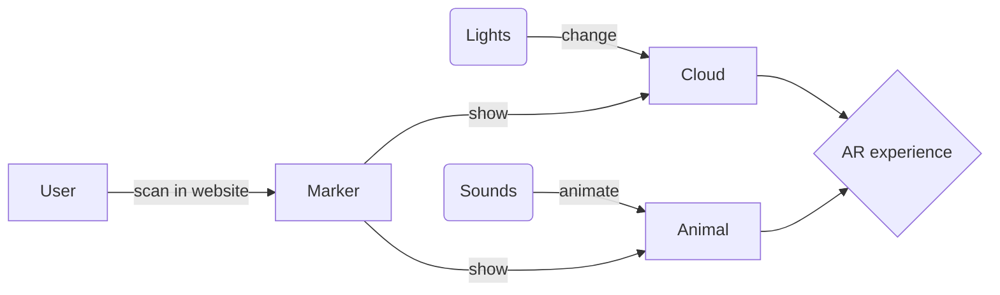
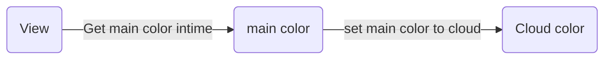

# Applying AR technology for art exhibition on Mobile devices

## Mock viva 🐦

<div class="absolute bottom-10">
  <span class="font-700">
    Wu Mingze
  </span>
</div>

<!--
Dear audience,

I am excited to share with you the find report of my project, which focuses on applying AR technology for art exhibition on mobile devices.

My project is in collaboration with the Beijing Cultural Center and will ultimately be exhibited in a theater.
-->

---

# Augmented Reality

> an interactive experience that combines the real world and computer-generated content.

<div class="grid-cols-2 gap-4 grid">

<div class="flex justify-center">

 <video src="/mock-viva-cloud.mp4" class="rounded-xl h-96" controls autoplay loop></video>

</div>

<div class="flex justify-center">

 <video src="/fox-page.mp4" class="rounded-xl h-96" controls autoplay loop></video>

</div>

</div>

<!--
 AR is to combine the real world and computer-generated content, which means u can see overlay of generated content by screen and the real world by camera, and here is the demo of my project which is a cloud and a fox. To be emphasized, the cloud is changing color according to the color behind the marker, and the fox is changing its action according to the volume of the surrounding environment. And most AR projects based on mobile devices can not interact with the real world, but my project can. U can see the fox is changing its action according to the volume of the surrounding environment. and the cloud is changing color according to the color behind the marker. User can interact with the art exhibition will interest them more.
 -->

---

# Introduction

> The project is in collaboration with the Beijing Cultural Center and will ultimately be exhibited in a theater. To displaying a cloud and an animal subject that respond to changes in light and sound


 <br/>
 <br/>



<!--
The project is in collaboration with the Beijing Cultural Center and will ultimately be exhibited in a theater. Here is the basic idea of the project. Here is the product flow The user will scan the marker on the ground with their mobile phone to observe the cloud, and the cloud will change color according to the color behind the marker. The user can also observe the fox by scanning the marker on the ground in the sub site, and change the fox's actions by talking and shouting. The goal of this project is to create a new and exciting way for people to experience and appreciate art.
-->

---

# Related technologies

<br/>
<br/>

<div class="grid grid-cols-3 gap-5">

<div class="bg-zinc-200/50 dark:bg-zinc-700/50 w-full h-40 rounded-xl p-4">
  <div class="flex gap-4">
    <LogosFramed class="w-8 h-8"/>
    <span class="text-3xl font-bold">Aframe</span>
  </div>
  <p> A web framework for building 3D/AR/VR experiences </p>
</div>

<div class="bg-zinc-200/50 dark:bg-zinc-700/50 w-full h-40 rounded-xl p-4">
  <div class="flex gap-4">
    <div class="i-akar-icons-augmented-reality w-8 h-8 bg-gradient-to-r from-blue-100 via-blue-300 to-blue-500 "></div>
    <span class="text-3xl font-bold">Ar.js</span>
  </div>
  <p> A lightweight library for Augmented Reality on the Web </p>
</div>

<div class="bg-zinc-200/50 dark:bg-zinc-700/50 w-full h-40 rounded-xl p-4">
  <div class="flex gap-4">
    <div class=" i-ic-outline-control-camera bg-gradient-to-r from-indigo-300 to-purple-400 w-8 h-8 "></div>
    <span class="text-3xl font-bold" >Tracking.js</span>
  </div>
  <p> Brings different computer vision algorithms into the browser environment. </p>
</div>

<div class="bg-zinc-200/50 dark:bg-zinc-700/50 w-full h-40 rounded-xl p-4">
  <div class="flex gap-4">
    <SkillIconsThreejsLight class="w-8 h-8"/>
    <span class="text-3xl font-bold" >Three.js</span>
  </div>
  <p> A JavaScript library used to display animated 3D computer graphics on a Web browser </p>
</div>

<div class="bg-zinc-200/50 dark:bg-zinc-700/50 w-full h-40 rounded-xl p-4">
  <div class="flex gap-4">
    <LogosTensorflow class="w-8 h-8"/>
    <span class="text-3xl font-bold">TensorFlow.js</span>
  </div>
  <p>A library for machine learning in JavaScript.</p>
</div>

<div class="bg-zinc-200/50 dark:bg-zinc-700/50 w-full h-40 rounded-xl p-4">
  <div class="flex gap-4">
    <div class="i-simple-icons-opencv w-8 h-8 bg-gradient-to-r from-indigo-200 via-red-200 to-yellow-100"> </div>
    <span class="text-3xl font-bold">OpenCV.js</span>
  </div>
  <p> A JavaScript binding for selected subset of OpenCV functions for the web platform </p>
</div>

</div>

<!--
A project is a combination of many technologies.

Here is the list of the technologies that I have used in this project. The first one is Aframe, which is a web framework for building 3D/AR/VR experiences. I use it to make fox model animate. The second one is Ar.js, which is a lightweight library for Augmented Reality on the Web. It is used to track the marker and detect the space. The third one is Tracking.js, which brings different computer vision algorithms into the browser environment. It is used to track each frame in the screen. The fourth one is Three.js, which is a JavaScript library used to display animated 3D computer graphics on a Web browser. I use it to make detail shader effect of cloud. The fifth one is Blender, which is a open-source 3D computer graphics software tool creating 3D models. It is used to make the animal model The last one is OpenCV.js, which is a JavaScript binding for selected subset of OpenCV functions for the web platform. It can make multiple cv operation from the frame but OpenCv.js is not used in the final plan
-->

---
layout: section
---

# Implementation and Results


---
layout: two-cols
---

# Main Page

> User select the page they want to go to by clicking the button in the main page

* 🏃‍♂️ View by Motion Sensor
* 🖐️ Scale by Finger Touch
* 🔘 Click the Button to Redirect to the Page

::right::

<div class="w-full h-full flex justify-center items-center">
  <iframe src="https://cloud.lawted.tech" class="h-full w-2/3 rounded-xl"></iframe>
</div>

<!--
First up is the homepage. All the pages have been deployed to my personal website, cloud.lawted.tech. When you enter the homepage, you will see the model. By clicking on the corresponding model, you will be taken to the AR website. In the website, we have utilized the gyroscope to control the model. Currently, the model of the cloud is still being refined
-->

---

# Get main color realtime

use a class written by `whoiam2007s` to track the main color of the sky part, but change the input image type from canvas image to uint8array

<br/>

```js{1-8|9}
new ImgMainColor(
  {
    imageData: skyView,
  },
  function (color) {
    const { hex } = color
    currentColor.style.backgroundColor = hex;
    currentColor.innerHTML = hex;
    light.attributes['light'].value = `type: ambient; color: ${hex}`;
  }
);
```



<!--
we use a class written by github user to track the main color of the sky part, but change the input image type from canvas image to uint8array to make it work with tracking.js, and bind the color to the ambient light
-->

---

# Cloud shader

Blender not support volume rendering, so we use three.js to render the cloud with shader

<div class="grid grid-cols-2 gap-4">

<div>

```glsl
const vertexShader = /* glsl */ `
					uniform vec3 cameraPos;

					out vec3 vOrigin;
					out vec3 vDirection;

					void main() {
						vec4 mvPosition = modelViewMatrix * vec4( position, 1.0 );
          ...

const fragmentShader = /* glsl */`
					precision highp float;
					precision highp sampler3D;

					uniform mat4 modelViewMatrix;
					uniform mat4 projectionMatrix;

					in vec3 vOrigin;
					in vec3 vDirection;

					out vec4 color;
          ...
```
</div>

  <video src="/cloud-shader.mp4" class="rounded-xl h-full " controls autoplay loop></video>

</div>

<!--
glsl is a shader language, we use it to implement the cloud effect (volume ray cast effect), and it use GPU to render the cloud, with the time elapsed, the cloud will change its texture to show different shape
-->

---

<div class="grid grid-cols-4 gap-4">

<div class="col-span-3">

# Cloud Page

> Users scan the marker on the ceiling with their mobile phone to observe the cloud, and the cloud will change color according to the color behind the marker

<br/>

## Feature
* ☁️ Deploy the [Cloud Page](https://cloud.lawted.tech/cloud)
* 🎨 Track the Main Color of the Screen and Change the Color of the Cloud
* ⚙️ Orbit Control the Object and Scale by Finger Touch
* <FileIconsVertexshader/> Use shader to implement the cloud effect (volume ray cast effect)

</div>

<div class="col-span-1 h-full flex justify-center items-center">
  <video src="/mock-viva-cloud.mp4" class="rounded-xl object-scale-down" controls autoplay loop></video>
</div>

</div>

<!--
In the video on the right, we can see how the cloud is currently being tracked through a marker. When the background color behind the cloud changes, the cloud's base color changes quickly in response. From different angles, you can observe different sides of the cloud, as if there is a real cloud floating in space.

-->

---

# Use tensorflow to recognize speech

Users can use speech to control the fox's actions, and the model is trained by myself

<br/>

```js
function buildModel() {
  model = tf.sequential();
  model.add(tf.layers.depthwiseConv2d({
    depthMultiplier: 8,
    kernelSize: [NUM_FRAMES, 3],
    activation: 'relu',
    inputShape: INPUT_SHAPE
  }));
  model.add(tf.layers.maxPooling2d({poolSize: [1, 2], strides: [2, 2]}));
  model.add(tf.layers.flatten());
  model.add(tf.layers.dense({units: 3, activation: 'softmax'}));
  const optimizer = tf.train.adam(0.01);
  model.compile({
    optimizer,
    loss: 'categoricalCrossentropy',
    metrics: ['accuracy']
  });
}
```

<!--
We use tensorflow.js to detect the voice by human, and the model is trained by myself,The model consists of a depthwise convolutional layer, a max pooling layer, a flatten layer, and a dense layer. The model is compiled using the Adam optimizer with a learning rate of 0.01, a categorical cross-entropy loss function, and accuracy as the evaluation metric. This code is used to build a machine learning model for a multi-class classification problem, which can be trained and evaluated using TensorFlow.js on the browser, and the labels are "run", "walk", and "survey".
-->
---

<div class="grid grid-cols-4 gap-4">

<div class="col-span-3">

# Fox Page

> Users can observe the fox by scanning the signs on the ground, and change the fox's actions by talking and shouting.

<br/>

<div class="absolute right-80 top-60 flex">
<div class="flex flex-col justify-between h-50 mr-1">
  <h3>
    HIGH
  </h3>
  <h2 style="writing-mode: vertical-rl; transform: rotate(180deg)" >
    Volume
  </h2>
  <h3 >
    Low
  </h3>
</div>

<div class="flex flex-col border-light-500 border-2 rounded-lg justify-between my-1 ">

  <div class="bg-red-400 rounded-t-md h-20 text-center"> run </div>
  <div class="bg-green-400 h-15 text-center"> walk </div>
  <div class="bg-gray-400 rounded-b-md h-15 text-center p-1"> survey </div>


</div>
</div>


## Feature

* 🦊 Deploy the [Fox Page](https://cloud.lawted.tech/fox)
* 🔊 Detect the level of the surrounding environment volume
* 🎥 Animation will Change when Volume Meter Changes
* ⚙️ Orbit Control the Object and Scale by Finger Touch
* <LogosTensorflow/> Use `tensorflow.js` to detect the voice by human

</div>


<div class="col-span-1 h-full flex justify-center items-center">
  <video src="/fox-page.mp4" class="rounded-xl object-scale-down" controls autoplay loop></video>
</div>

</div>

<!--
In the video on the right, we can see a fox turning its head on a marker. On the small box on the left side of the screen, the current surrounding volume is displayed. When I speak, the fox will walk, and when I shout, it will run. Currently, the interaction between the fox and the user is mainly based on the volume of the user's voice.Also as I introduced before, user can also use speech to control the fox's actions, and the tensorflow model is trained by myself.
-->


---

# Conclusion

* The cloud Demo shows the potential of lights and shadows
* The fox Demo shows the potential of speech recognition and sound
* 📱 We can use the AR technology to create more interactive art exhibition

<br/>
<br/>
<br/>

# Further Work

* turn demo into a real art exhibition
* let more models be interact with user
* use GPT to generate more interact shaders code or Introductions
* use SAM(segment anything model by Meta) to segment the background and the object

<!--
In conclusion, I am very excited about the progress we have made so far with applying AR technology to art exhibition on mobile devices. By leveraging the latest advancements in AR, machine learning, and other cutting-edge technologies, we are creating a unique and immersive experience that allows users to interact with art in a whole new way.
-->

---

# Demo Time

Use wechat to scan the QR code to visit the demo


---
layout: none
---

<div class="w-full h-full bg-white flex justify-center items-center ">
  
</div>

<style>
  .background-animate {
    background-size: 400%;

    -webkit-animation: changColor 15s ease infinite;
    -moz-animation: changColor 15s ease infinite;
    animation: changColor 15s ease infinite;
  }

  @keyframes changColor {
    0%,
    100% {
      background-position: 0% 50%;
    }
    50% {
      background-position: 100% 50%;
    }
  }
</style>


---
layout: quote
---

# "Thanks for your listening!"

<!--
In conclusion, I am very excited about the progress we have made so far with applying AR technology to art exhibition on mobile devices. By leveraging the latest advancements in AR, machine learning, and other cutting-edge technologies, we are creating a unique and immersive experience that allows users to interact with art in a whole new way.

Thanks for your listening
-->
