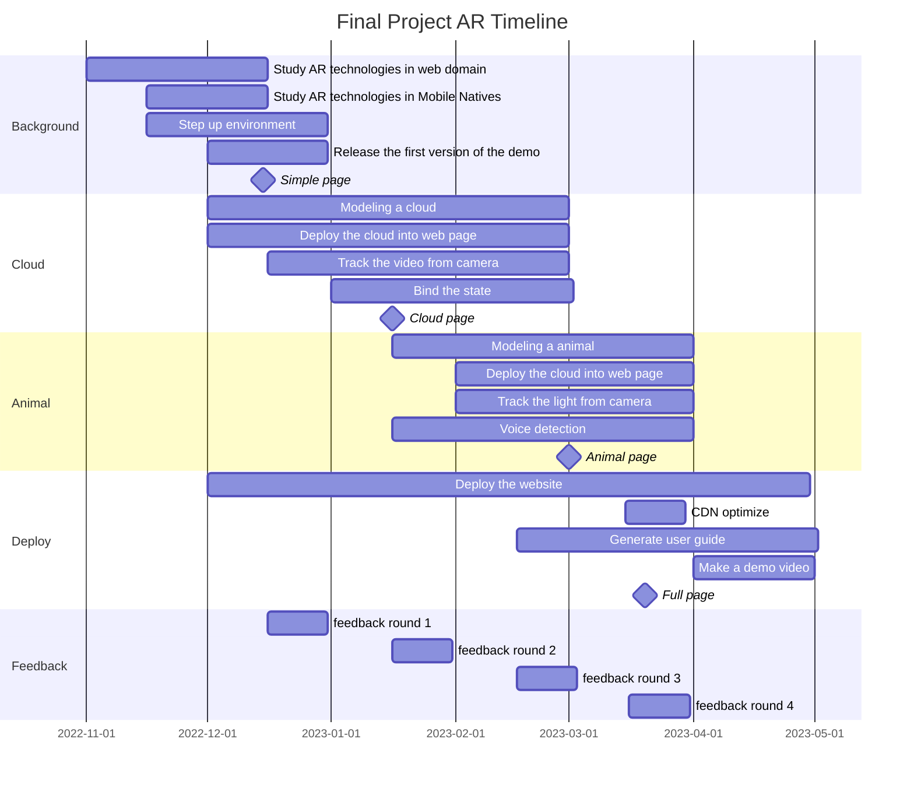

# Timeline

<!--
here is the timeline that I've outlined in the project specification, with the red line indicating the current date. Today, I'll be sharing my progress on several key parts of the project, corresponding to different stages in the timeline.
-->
